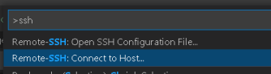

# Rust: Hack Without Fear ! (docker_rust_development)

**A complete development environment for Rust with VSCode inside a docker container.**  
***version: 2022.324.1258  date: 2022-03-24 author: [bestia.dev](https://bestia.dev) repository: [GitHub](https://github.com/bestia-dev/docker_rust_development)***  

[](https://github.com/bestia-dev/docker_rust_development/)  [](https://github.com/bestia-dev/docker_rust_development/)  [](https://github.com/bestia-dev/docker_rust_development/blob/master/LICENSE)


## Try it

Super short instructions without explanation. For tl;dr; continue reading below.

Prerequisites: Win10, WSL2, VSCode.

Open VSCode and install extension `Remote - SSH`.

Clone this repository to get the bash scripts, then install `podman`, pull the docker images and run the bash scripts.
In the code below change my `Luciano` with your username.  
In `WSL2 terminal`:

```bash
git clone https://github.com/bestia-dev/docker_rust_development.git
cd docker_rust_development
# create new SSH keys with name githubssh1
ssh-keygen -f ~/.ssh/cntssh1 -t ecdsa -b 521
# give it a passphrase and remember it, you will need it
sudo apt-get update
sudo apt-get install podman
podman pull docker.io/bestiadev/rust_dev_squid_img:latest
podman pull docker.io/bestiadev/rust_dev_vscode_img:latest
sh rust_dev_pod_create.sh
sh rust_dev_pod_start.sh
```

In VSCode, press `F1`, type `ssh` and choose `Remote-SSH: Open SSH configuration File...` choose `c:\Users\Luciano\.ssh\config`.
Add to this file:

```bash
Host cnt2201
  HostName localhost
  Port 2201
  User rustdevuser
  IdentityFile c:\Users\Luciano\.ssh\githubssh1
  IdentitiesOnly yes
  
```

Save it and close it.  
Then `F1`, type `ssh` and choose `Remote-SSH: Connect to Host...` and choose `cnt2201`.
Choose `Linux` if asked and type your passphrase.  
If we are lucky, everything works and you are over SSH inside the container now.

In `VSCode terminal`:

```bash
cd ~/rustprojects
cargo new rust_dev_hello
cd rust_dev_hello
cargo run
```

That should work!

## Motivation

Rust is a fantastic young language that empowers everyone to build reliable and efficient software. It enables simultaneously low-level control without giving up high-level conveniences. But with great power comes great responsibility !

Rust programs can do any "potentially harmful" things to your system. That is true for any compiled program, Rust is no exception.

But Rust can do anything also in the compile-time using `build.rs` and `procedural macros`. Even worse, if you open a code editor (like VSCode) with auto-completion (like Rust-analyzer), it will compile the code in the background without you knowing it. And the `build.rs` and `procedural macros` will run and they can do "anything" !

Even if you are very careful and avoid `build.rs` and `procedural macros`, your Rust project will have a lot of crates in the dependency tree. Any of those can surprise you with some "malware". This is called a "supply chain attack".

It is very hard to avoid "supply chain attacks" in Rust as things are today. We are just lucky, that the ecosystem is young and small and the malevolent players are waiting for Rust to become more popular. Then they will strike and strike hard. We need to be skeptical about anything that comes from the internet. We need to isolate/sandbox it so it cannot harm our system.  

Let learn to develope "everything" inside a Docker container and to isolate/sandbox it as much as possible from the underlying system.

I have to acknowledge that Docker Linux Containers are not the perfect sandboxing solution. But I believe that for my "Rust development environment", it is "good enough". I expect that container isolation will get better with time (google, amazon, Intel, OpenStack and IBM are working on it). My main system is Win10. Inside that, I have WSL2, which is a Linux virtual machine. And inside that, I have Docker Linux Containers.
No files/volumes are shared with the host.
The outbound network is restricted to whitelisted domains by a Squid proxy server.
The inbound network is allowed only to "published/exposed" ports.
Yes, there exists the possibility of abusing a kernel vulnerability, but I believe it is hard and they will get patched.

## Docker and OCI

We all call it Docker, but [Docker](https://www.docker.com/) is just a well known company name with the funny whale logo.
They developed and promoted Linux containers. Then they helped to create an open industry standards around container formats and runtimes. This standard is now called OCI (Open Container Initiative). So the correct name is "OCI containers" and "OCI images".

But "OCI" is a so boring name. I will still use the terms "Docker containers" and "Docker images" even if other companies can work interchangeably with them because of the OCI standards.

And there are alternatives to use Docker software that I will explore here.

## Install Podman in Win10 + WSL2 + Debian 11(Bullseye)

[Podman](https://podman.io/) is a **daemonless**, open source, Linux native tool designed to work with Open Containers Initiative (OCI) Containers and Container Images. Containers under the control of Podman can be run by a **non-privileged user**. The CLI commands of the Podman ***"Container Engine"*** are practically identical to the Docker CLI. Podman relies on an OCI compliant ***"Container Runtime"*** (runc, crun, runv, etc) to interface with the operating system and create the running containers.

I already wrote some information how to install and use the combination of Win10 + WSL2 + Debian11(Bullseye):

<https://github.com/bestia-dev/win10_wsl2_debian11>

Podman is available from the Debian11 package manager.

<https://podman.io/getting-started/installation>

Let's install it as rootless.

Open the `WSL2 terminal` and type:

```bash
sudo apt-get update
sudo apt-get install podman
podman version
```

Here we see some errors.

Wsl2 has a special kernel and Podman needs a small trick to work.

<https://www.redhat.com/sysadmin/podman-windows-wsl2>

<https://www.youtube.com/watch?v=fWFNGxJNZ8Y>

```bash
mkdir $HOME/.config/containers
nano $HOME/.config/containers/containers.conf
```

In this empty new file `containers.conf` write just this 3 lines and save:

```conf
[engine]
cgroup_manager = "cgroupfs"
events_logger = "file"
```

Now you can command again and the result has no errors:

``` bash
podman version
```

## Using Podman

Using the Podman CLI is just the same as using Docker CLI.

<https://podman.io/getting-started/>

Inside the `WSL2 terminal` type:

```bash
podman images
```

We have no images for now.
The words "image" and "container" are somewhat confusing. Super simplifying: When it runs it is a "container". If it does not run it is an "image". The image is just an "installation file". The containers can be `started` and `stopped` or `attached` and `detached`, but they are "run" only one time.

For test, run a sample container. It is a web server.

-d means it is run in a detached mode  
-t adds a pseudo-tty to run arbitrary commands in an interactive shell  
-p stays for publish port

The run command will download/pull the image if needed.

```bash
podman run -dt -p 8001:80/tcp docker.io/library/httpd
```

List all containers:

```bash
podman ps -a
```

Testing the httpd container:

```bash
curl http://localhost:8001
```

That should print the HTML page.

Finally you can remove the "last" container we used:

```bash
podman rm -l 
```

You can also remove the image, because this was just practice for learning:

```bash
podman rmi -l 
```

## Buildah for our Rust development images

Buildah is a replacement for the `docker build` command. It is easier to incorporate into scripts. It is pronounced exactly as Builder, but with a Bostonian accent ;-)

<https://opensource.com/article/18/6/getting-started-buildah>

The Rust official images are on Docker hub: <https://hub.docker.com/_/rust>

I was surprised by the size of the image. It is big from 200Mb compressed to 1.2Gb uncompressed. But this is mostly the size of rust files.

I don't like that this images have only the `root` user. I will start from the Debian-11 image and install all I need as the `rustdevuser`.

Pull the image from Docker hub:

```bash
podman pull docker.io/library/debian:bullseye-slim
```

I wrote the bash script `rust_dev_cargo_img.sh`

Run it with

```bash
sh rust_dev_cargo_img.sh
```

This will create the image `rust_dev_cargo_img`.

The scripts sre just bash scripts and are super easy to read, follow, learn and modify. Much easier than Dockerfile. You can even run the commands one by one in the `WSL2 terminal` and inspect the container to debug the building process.

## Rust development in a Docker container

There is a lot of benefits making a development environment in a container.

We want that everything is isolated/sandboxed and cannot affect our host system (WSL2 and Win10).

We also don't want to make any changes to our system because of Rust tools or our project needs.

We can have simultaneously more containers, each with a different version of Rust or a different toolchain with all the necessary configuration and tools. We can easily transfer the container to another system and use it exactly as it is configured. Effortlessly.

Everybody uses `podman run`, but this is essentially 4 commands in one: `pull` from a repository, `create` the container, `start` or `attach` to the container and exec the bash in interactive mode. I like to use this commands separately, because it makes more sense for learning.

Create the container with a fixed name rust_dev_cargo_cnt:

--name - the container name will be `rust_dev_cargo_cnt`  
-ti - we will use the container interactively in the terminal  

```bash
podman create -ti --name rust_dev_cargo_cnt docker.io/bestiadev/rust_dev_cargo_img:latest/
```

We can list the existing containers with:

```bash
podman ps -a
```

Now we can start the container:

```bash
podman start rust_dev_cargo_cnt
```

Open the bash to interact with the `container terminal`:
-it - interactive terminal

```bash
podman exec -it rust_dev_cargo_cnt bash
```

We are now inside the `container terminal` and we can use `cargo`, `rustup` and other rust tools. The files we create will be inside the container. We are `rustdevuser` inside this container, so we will put our rustprojects in the `/home/rustdevuser/rustprojects` directory.

This container is started from Podman without `root access` to the host system !

This is a small, but important difference between Docker and Podman.

First let find the rustc version:

```bash
cargo --version
  cargo 1.59.0 (49d8809dc 2022-02-10)
```

Let create and run a small Rust program:

```bash
cd ~/rustprojects
cargo new rust_dev_hello
cd rust_dev_hello
cargo run
```

That should work fine!

We can exit the container now with the command

```bash
exit
```

When we exited the container we returned to `WSL2 terminal`.

The container still exists and is still running. Check with `podman ps -a`.

To interact with it again, repeat the previous command `podman exec -it rust_dev_cargo_cnt bash`.

This container does not work with VSCode and we will not need it any more. If you use another editor, you can customize and use this image/container.

Remove the container with:

```bash
podman rm rust_dev_cargo_cnt -f
```

## VSCode from Windows to WSL2 to container

I use VSCode as my primary code editor in Windows. It works fine remotely with WSL2 (Debian Linux) with the `Remote - WSL` extension.

There is also a `Remote - Containers` extension, that lets you use a Docker container as a full-featured development environment. First install this extension in VSCode.

<https://www.jonathancreamer.com/setting-up-wsl2-and-the-vscode-containers-plugin/>

We need to change 2 settings because we want to use Podman instead of Docker and we want to execute all commands inside WSL2.

In VSCode open File-Preferences-Settings or Ctrl+,

Search for `remote.containers.dockerPath`. Type `/usr/bin/podman`.

Search for `remote.containers.executeInWSL` and enable it.


There are a lot of `automagic easy to use` functions in this extension. But for some reason `automagic` never worked for me. I must always go painfully step-by-step and discover why the `automagic` does not work in my case. Always!

The bash script `rust_dev_vscode_img.sh` will create the image `rust_dev_vscode_img`.

Run it with:

```bash
sh rust_dev_vscode_img.sh
```

This is based on the first image and adds the VSCode server and extensions.

I like to run the container in a terminal first and then attach to it from VSCode. Create and start the container in a `WSL2 terminal`:

```bash
podman create -ti -p 127.0.0.1:8001:8001/tcp --name rust_dev_vscode_cnt docker.io/bestiadev/rust_dev_vscode_img:latest
podman start rust_dev_vscode_cnt
```

In VSCode "Activity bar" click on the icon `Remote Explorer`. Up-right instead of `WSL Targets` choose `Containers`. There is a list of containers and among them our `localhost/rust_dev_vscode_img rust_dev_vscode_cnt`. Right click on it and choose `Attach in New Window`.


There is also the shorter way without mouse: Open VSCode, press `F1`, type `attach` and choose `Remote-Containers:Attach to Running container...` and type `rust_dev_vscode_cnt`.
  

This will open a new VSCode windows attached to the container. In the left bottom corner there is the green label with the container name.

We can now edit, compile and run Rust projects in VSCode inside the container.

## VSCode terminal

VSCode has an integrated `VSCode terminal`. It has some advantages for developers that the standard `WSL2 terminal` does not have.
It is great to use it for everything around code in containers. You can open more then one `VSCode terminal` if you need to. For example if you run a web server.

If the `VSCode terminal` is not opened simply press `Ctrl+j` to open it and the same to close it.

Inside `VSCode terminal`, we will create a sample project:

```bash
cd ~/rustprojects
cargo new rust_dev_hello
cd ~/rustprojects/rust_dev_hello
```

This easy command opens a new VSCode window exactly for this project/folder inside the container:

```bash
code .
```

A new VSCode windows will open for the `rust_dev_hello` project. You can close now all other VSCode windows.

Build and run the project in the `VSCode terminal`:

```bash
cargo run
```

That should work!

Leave VSCode open because the next chapter will continue from here.

## Push changes to Github

I like to work with Github over SSH and not over https.

To make SSH work I need the file with the private key for SSH connection. I already have this one in WSL2 in the file `~/.ssh/githubssh1`. I will copy it into the container. If your file has a different name, first copy it to `~/.ssh/githubssh1`, so you can follow the subsequent commands easily.

Be careful ! This is a secret !

It means that this container I cannot share anymore with anybody. It is now my private container. I must never make an image from it and share it. Never !

Open a new `WSL2 terminal` and copy the file with podman into the container:

```bash
# in WSL2, outside the container
podman cp ~/.ssh/githubssh1 rust_dev_vscode_cnt:/home/rustdevuser/.ssh/githubssh1
# close the `WSL2 terminal`
```

The `VSCode terminal` is still opened on the project `rust_dev_hello`.

It is comfortable to use the `ssh-agent` to store the passphrase in memory, so we type it only once.

Again attention, that this container has secrets and must not be shared ! Never !

In the `VSCode terminal` (Ctrl+j) run:

```bash
eval $(ssh-agent)
ssh-add /home/rustdevuser/.ssh/githubssh1
# enter your passphrase
```

Open `github.com` in the browser and sign in, click `New` and create a new repository named `rust_dev_hello`.

Github is user friendly and shows the standard commands we need to run.

Modify the commands below to **your** Github repository.

In the `VSCode terminal` run:

```bash
git init
git add *
git commit -m "first commit"
git branch -M main
git remote add origin git@github.com:bestia-dev/rust_dev_hello.git
git push -u origin main
```

Done! Check your Github repository.
Always push the changes to Github. So you can delete this container and create a new empty one, then pull the code from Github and continue developing. Containers are the worst place to have persistent data stored. They can be deleted any second for any reason.
Leave VSCode open because the next chapter will continue from here.

## Existing Rust projects on Github

You probably already have a Rust project on Github. You want to continue its development inside the container.

For an example we will use my PWA+WebAssembly/WASM project `rust_wasm_pwa_minimal_clock`, that needs to forward the port 8001, because our project needs a web server. That is fairly common. I am not a fan of autoForward `automagic` in VSCode, so I disable it in `File-Preferences-Settings` search `remote.autoForwardPorts` and uncheck it to false.

We will continue to use the existing `VSCode terminal`, that is already opened on the folder `/home/rustdevuser/rustprojects/rust_dev_hello`. Just to practice.

Run the commands to clone the repository from Github and open a new VSCode window. We already have the SSH private key and `ssh-agent` running:

```bash
cd /home/rustdevuser/rustprojects/
git clone git@github.com:bestia-dev/rust_wasm_pwa_minimal_clock.git
cd rust_wasm_pwa_minimal_clock
code .
```

The `code .` command will open a new VSCode window in the folder `rust_wasm_pwa_minimal_clock`. In the new VSCode window, we can now edit, compile and run the project. All sandboxed/isolated inside the container. We can now close the old window, we don't need it any more.

This example is somewhat more complex, because it is WebAssembly, but it is good for learning. I used the automation tool `cargo-auto` to script a more complex building process. You can read the automation task code in `automation_task_rs/src/main.rs`. On the first build it will download the wasm components and wasm-bindgen. That can take some time. Don't despair.

Now we can build and run the project in `VSCode terminal` (Ctrl+j):

```bash
cargo auto build_and_run
```

Open the browser in Windows:

`http://localhost:8001/rust_wasm_pwa_minimal_clock/`

This is an example of Webassembly and PWA, directly from a docker container. A good learning example.

## VSCode tools

VSCode is great because of its extensions. Most of these extensions are already installed inside the image `rust_dev_vscode_img`:

- streetsidesoftware.code-spell-checker
- matklad.rust-analyzer
- davidanson.vscode-markdownlint
- 2gua.rainbow-brackets
- dotjoshjohnson.xml
- lonefy.vscode-js-css-html-formatter
- serayuzgur.crates

Other extensions you can add manually through VSCode, but then it is not repeatable. Better is to modify the script that creates the image `rust_dev_vscode_img.sh`.

## Volumes or mount restrictions

I don't want that the container can access any file on my local system.

This is a "standalone" development container and everything must run inside.

The files can be cloned/pulled from Github or copied manually with `podman cp`.

## Network Inbound restrictions

I would like to restrict the use of the network from/to the container.

When using Podman as a rootless user, the network is setup automatically. Only the `localhost` can be used. The container itself does not have an IP Address, because without root privileges, network association is not allowed. Port publishing as rootless containers can be done for "high ports" only. All ports below `1024` are privileged and cannot be used for publishing.

I hope/think that all inbound ports are closed by default and I need to explicitly expose them manually.

## Network Outbound restrictions with Squid proxy in container

I would like to limit the access to the internet only to whitelisted domains:

crates.io, github.com,...

Some malware could want to "call home" and I will try to disable this.

What I need is a "proxy" or "transparent proxy". I will use the leading open-source proxy `Squid`, but in a container.

It can restrict both HTTP and HTTPS outbound traffic to a given set of Internet domains, while being fully transparent for instances in the private subnet.

<https://aws.amazon.com/blogs/security/how-to-add-dns-filtering-to-your-nat-instance-with-squid/>

I want to use this proxy for the container `rust_dev_vscode_cnt`. Container-to-container networking can be complex.

Podman works with `pods`, that make networking easy. This is usually the simplest approach for two rootless containers to communicate. Putting them in a `pod` allows them to communicate directly over `localhost`.

First create a modified image for Squid with (run inside the rustprojects/docker_rust_development folder):

```bash
sh rust_dev_squid_img.sh
```

In `WSL2 terminal` create one `pod` with 2 containers and start them:

```bash
# Close VSCode if is open
podman ps -a
# remove the container if already exists: 
podman rm rust_dev_vscode_cnt -f

podman pod create --name rust_dev_pod
podman pod ls
podman create --name rust_dev_squid_cnt --pod=rust_dev_pod -ti --restart=always docker.io/bestiadev/rust_dev_squid_img:latest
podman start rust_dev_squid_cnt
podman create --name rust_dev_vscode_cnt --pod=rust_dev_pod -ti --env http_proxy=localhost:3128

rust_dev_vscode_img
podman start rust_dev_vscode_cnt
```

Open VSCode, press `F1`, type `attach` and choose `Remote-Containers:Attach to Running container...` and type `rust_dev_vscode_cnt`.

In `VSCode terminal` test the proxy:

```bash
# try curl with proxy for whitelisted domains
curl --proxy "localhost:3128" "http://httpbin.org/ip"
# it returns {"origin": "127.0.0.1, 46.123.250.35"}
curl --proxy "localhost:3128" "http://crates.io"
# works
curl --proxy "localhost:3128" "https://github.com/"
# works

# try curl with proxy for all other restricted domains
curl --proxy "localhost:3128" "http://google.com"
# it returns "ERR_ACCESS_DENIED"
curl --proxy "localhost:3128" "http://microsoft.com"
# it returns "ERR_ACCESS_DENIED"
```

It works. Only the whitelisted domains are allowed.

If you need, you can change the `etc_squid_squid.conf` to add more domains. Then run `sh rust_dev_squid_img.sh` to build the modified image.

Now delete completely the `pod` before the next chapter.

```bash
podman pod rm rust_dev_pod -f
```

## Env variables for proxy setting

Inside the container `rust_dev_vscode_cnt` I want that everything goes through the proxy. This env variables should do that:

`http_proxy`, `https_proxy`,`all_proxy`.

I can add this env variables when creating the container. I don't want to build this in the image.

Run the bash script to create a new `rust_dev_pod` with proxy settings:

```bash
sh rust_dev_pod_create.sh
```

Open VSCode, press `F1`, type `attach` and choose `Remote-Containers:Attach to Running container...` and type `rust_dev_vscode_cnt`.

In `VSCode terminal` test the proxy:

```bash
# try curl with proxy for whitelisted domains
curl "http://httpbin.org/ip"
# it returns {"origin": "127.0.0.1, 46.123.250.35"}
curl "http://crates.io"
# works
curl "https://github.com/"
# works

# try curl with proxy for all other restricted domains
curl "http://google.com"
# it returns "ERR_ACCESS_DENIED"
curl "http://microsoft.com"
# it returns "ERR_ACCESS_DENIED"
```

## Push image to docker hub

I signed in to hub.docker.com.

In Account settings - Security I created an access token. This is the password for `podman login`. It is needed only once.

Then I created a new image repository with the name `rust_dev_vscode_img` and tag `latest`. Docker is helping with the push command syntax. I use `podman`, so I just renamed `docker` to `podman`. The same for `rust_dev_squid_img`.

In `WSL2 terminal`:

```bash
podman login --username bestiadev docker.io
# type access token
podman push docker.io/bestiadev/rust_dev_cargo_img:latest
podman push docker.io/bestiadev/rust_dev_cargo_img:cargo-1.59.0

podman push docker.io/bestiadev/rust_dev_vscode_img:latest
podman push docker.io/bestiadev/rust_dev_vscode_img:vscode-1.66.0
podman push docker.io/bestiadev/rust_dev_vscode_img:cargo-1.59.0

podman push docker.io/bestiadev/rust_dev_squid_img:latest
podman push docker.io/bestiadev/rust_dev_squid_img:squid-3.5.27-2
```

It takes some time to upload more than 1.4 Gb.

## enter the container as root

Sometimes you need to do something as `root`.  
You don't need to use `sudo`. Just open the container as `root` user.  

```bash
podman exec -it --user root rust_dev_vscode_cnt bash
```

## sizes

Rust is not so small. I saved some 600MB of space just deleting the docs folder, that actually noone needs.  
docker.io/bestiadev/rust_dev_squid_img  squid3.5.27-2  168 MB
docker.io/bestiadev/rust_dev_cargo_img  cargo-1.59.0  1.08 GB
docker.io/bestiadev/rust_dev_vscode_img cargo-1.59.0  1.32 GB

## Tragedy struck! MUST change VSCode to SSH communication

Today I cannot attach VSCode to the containers anymore. Neither can I get a list or running containers.
Things just stop working. Oh, too much automagic for me. I have to do stuff manually, remember.  
I will try to connect VSCode to container with SSH. That was also my first idea, but it was not recommended for containers. There are different types of container defined by the content: system containers, application containers and developer containers. Here we have a development container that really acts like a lightweight virtual machine. Here it makes sense to have SSH installed. With it, it is also possible to access the container wherever it is. Just FYI `application containers` are not like VM, they are more like a complex executable. There makes not sense to SSH into container of that type.

First I install the `Remote - SSH` extension to VSCode.

Then I modified the `rust_dev_vscode_img` to have sshd server installed.
After creating the container we must modify the file `ssh_config`.  
I choose this configuration, maybe it can be improved:  

```bash
#sshd_config for rust_dev_vscode_cnt

AllowUsers rustdevuser

Port 2201

AuthenticationMethods publickey
PubkeyAuthentication yes

PasswordAuthentication no
ChallengeResponseAuthentication no
UsePAM no
PermitEmptyPasswords no
PermitRootLogin no
```

We also add `githubssh1.pub` the public key of authorized user in `authorized_keys`.  
In `WSL2 terminal`:

```bash
# remove the old container if is stuck. This will erase all the data.
podman rm rust_dev_vscode_cnt -f
# create the container
podman create -ti -p 127.0.0.1:2201:2201/tcp --name rust_dev_vscode_cnt docker.io/bestiadev/rust_dev_vscode_img:latest
# copy the sshd_config where the port 2201 is configured
podman cp etc_ssh_sshd_config.conf rust_dev_vscode_cnt:/etc/ssh/sshd_config
# copy the public certificate of authorized users
podman cp ~/.ssh/githubssh1.pub rust_dev_vscode_cnt:/home/rustdevuser/.ssh/authorized_keys
# start it
podman start rust_dev_vscode_cnt
# @link https://unix.stackexchange.com/a/193131/311426
# On Linux, you can disable password-based access to an account while allowing
# SSH access (with some other authentication method, typically a key pair) with:
podman exec -it --user=root  rust_dev_vscode_cnt usermod -p '*' rustdevuser
podman exec -it --user=root  rust_dev_vscode_cnt usermod -aG sudo rustdevuser
# restart the service
podman exec -it --user=root  rust_dev_vscode_cnt service ssh restart

# this now works from WSL2:
ssh -i /home/luciano/.ssh/githubssh1 -p 2201 rustdevuser@localhost
# exit
```

VSCode runs in windows and it uses `C:\WINDOWS\System32\OpenSSH\ssh.exe`.  
I must use the windows path and NOT the linux path for the SSH keys.  
I copied the SSH key `githubssh1` from Linux to Windows.  
Type in `windows cmd prompt terminal`:

```bash
copy "\\wsl$\Debian\home\luciano\.ssh\githubssh1" "c:\Users\Luciano\.ssh\githubssh1"
# now I can connect to SSH from Windows
"C:\WINDOWS\System32\OpenSSH\ssh.exe" -i c:\Users\Luciano\.ssh\githubssh1 -p 2201 rustdevuser@localhost
# it works
# exit
```

We must write the SSH configuration to the file `C:\Users\Luciano\.ssh\config`.
VSCode reads this file to work properly for `Remote - SSH`.  
Add this to the file content:  

```txt
Host cnt2201
  HostName localhost
  Port 2201
  User rustdevuser
  IdentityFile c:\Users\Luciano\.ssh\githubssh1
  IdentitiesOnly yes
```

Now we can open the SSH connection with this short command.  
Type in `windows cmd prompt terminal`:  

```bash
"C:\WINDOWS\System32\OpenSSH\ssh.exe" cnt2201
# it works
# exit
```

Finally we can open VSCode, press `F1` for `Command palette`, type `ssh` and choose `Remote-SSH: Connect to Host...`:  

  

Then choose `cnt2201`. It will open a new VSCode window. Enter your passphrase.  
It works. We are now in VSCode inside the container over SSH.  
I will add the podman commands to the `rust_dev_pod_create.sh`. So only this will be enough to create the containers and pod:  

```bash
sh rust_dev_pod_create.sh
```

## debug SSH connection

I needed to debug the connection to the `ssh server`, because the normal error messages are completely useless.  
From `WSL2 terminal` I enter the `container terminal` as `root`:  

```bash
podman exec -it --user=root  rust_dev_vscode_cnt bash
```

In `container terminal`:

```bash
service ssh stop
/usr/sbin/sshd -ddd -p 2201
# now we can see the verbose log when we attach an SSH client to this server. And we can see where is the problem.
# after debug, start the service, before exit
service ssh start
exit
```

To see the verbose log of the `SSH client` add `-v` like this:  

```bash
ssh -i /home/luciano/.ssh/githubssh1 -p 2201 rustdevuser@localhost -v
```

## Quirks

It is a complex setting. There can be some quirks sometimes.

## network namespace, user namespace

After rebooting my system and trying `podman ps -a` I got this error:

`error joining network namespace for container ...` or `cannot set user namespace`

This is because Podman was unable to detect that the system has rebooted in WSL2.

The solution in `WSL2 terminal` is simple:

```bash
rm -rf /tmp/run-$(id -u)/libpod/tmp
```

## ssh could not resolve hostname

Warning: The "ssh could not resolve hostname" is a common error. It is not that big of an issue. I closed everything and restart my computer and everything works fine now.

## TODO

Watch the log if the access is restricted to some domains:
podman exec -it rust_dev_squid_cnt cat /var/log/squid/access.log
podman exec rust_dev_squid_cnt tail -f /var/log/squid/access.log

new image with cargo-crev and cargo_crev_reviews
new image with windows cross compile
scchache for faster builds, when repeated? not really important for containers.

## cargo crev reviews and advisory

We live in times of danger with [supply chain attacks](https://en.wikipedia.org/wiki/Supply_chain_attack).  
It is recommended to always use [cargo-crev](https://github.com/crev-dev/cargo-crev)  
to verify the trustworthiness of each of your dependencies.  
Please, spread this info.  
You can also read reviews quickly on the web:  
<https://web.crev.dev/rust-reviews/crates/>  

## open-source and free as a beer

My open-source projects are free as a beer (MIT license).  
I just love programming.  
But I need also to drink. If you find my projects and tutorials helpful,  
please buy me a beer donating on my [paypal](https://paypal.me/LucianoBestia).  
You know the price of a beer in your local bar ;-)  
So I can drink a free beer for your health :-)  
[Na zdravje!](https://translate.google.com/?hl=en&sl=sl&tl=en&text=Na%20zdravje&op=translate) [Alla salute!](https://dictionary.cambridge.org/dictionary/italian-english/alla-salute) [Prost!](https://dictionary.cambridge.org/dictionary/german-english/prost) [Nazdravlje!](https://matadornetwork.com/nights/how-to-say-cheers-in-50-languages/) 🍻
